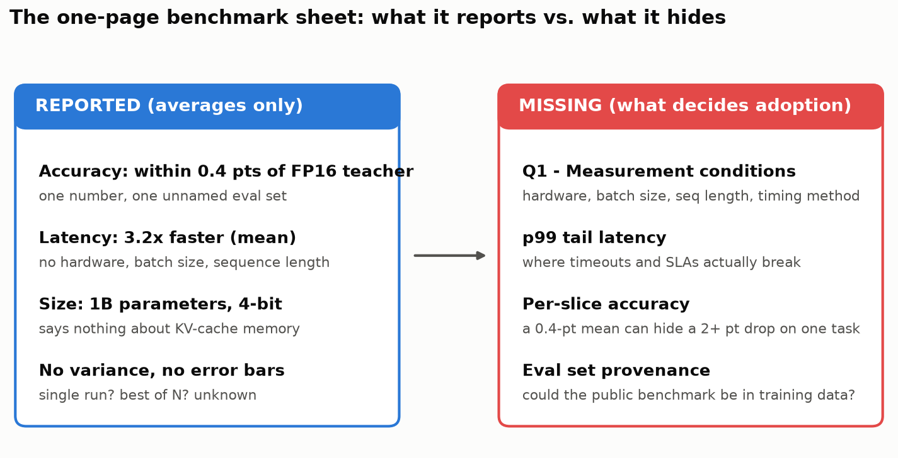
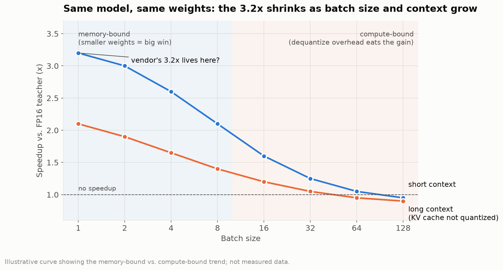
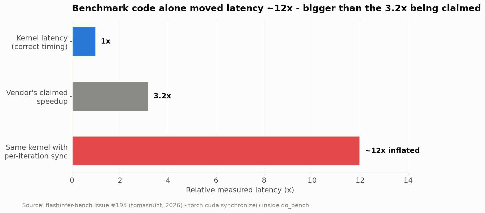
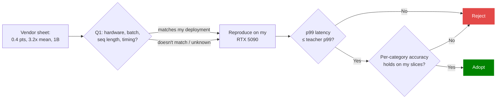
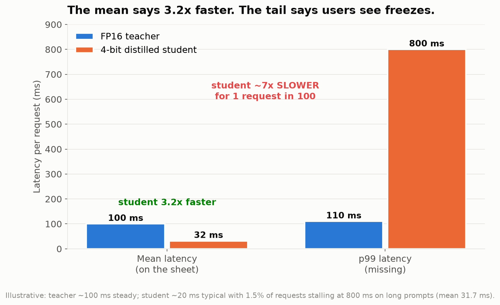
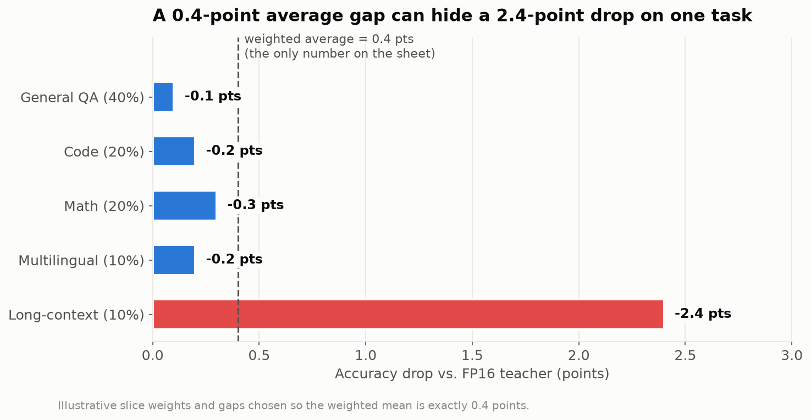

# Week-05-Discussion-The-One-Page-Benchmark-Sheet-Discussion-Required
Week 5 Discussion: The One-Page Benchmark Sheet Discussion

> **The pitch:** a vendor's "4-bit quantized, distilled 1B model that matches the FP16 teacher within 0.4 accuracy points and runs 3.2x faster." The one-page sheet reports a single accuracy number, mean latency, and total parameter count. Nothing else.

| | My answer |
|---|---|
| **First question** | On what hardware, at what batch size and sequence length, and with what timing method was the 3.2x measured? |
| **Missing number** | **p99 (99th-percentile) latency**, followed by per-category accuracy |
| **Decision rule** | Adopt only if p99 latency and per-category accuracy hold up on my own hardware (RTX 5090) |

## 1. First question for the vendor

> **"On what hardware, at what batch size and sequence length, and with what timing method did you measure the 3.2x speedup?"**

Most of the benefit of 4-bit weights is memory-bandwidth savings.

- **Batch size 1:** decoding is memory-bound, so smaller weights give the largest gain.
- **Large batch:** decoding becomes compute-bound. Dequantizing back to 16-bit adds overhead, so the speedup shrinks.
- **Long context:** the KV cache grows with sequence length, and weight-only quantization does not compress it.
- **No native low-precision kernels:** much of the gain can disappear.

The timing method matters just as much. In a FlashInfer-Bench issue, one extra `torch.cuda.synchronize()` per iteration made a kernel appear about **12x slower** than it was (tomasruizt, 2026). If benchmark code alone can move latency by 12x, a 3.2x ratio tells me little until I know how it was measured.

## 2. Why this question has the highest value

This question decides whether **either** number on the sheet applies to my deployment. If the 3.2x came from batch size 1 with short prompts on a datacenter GPU, it says nothing about my RTX 5090 serving long prompts at batch 16.

The readings support this. Suwannaphong et al. (2025) showed that the right compression choice depends on the target device's memory budget:

| Model | Fits in RAM | Compression needed |
|---|---|---|
| Transformer (quantized) | 64 KB | Yes |
| Mamba SSM (Gu & Dao, 2023) | 32 KB | No |

The deployment target drives the result. My follow-up question would be **which evaluation set produced the 0.4-point gap**, since a public benchmark may overlap the training data.

## 3. The missing metric: p99 tail latency

The number I most want is **99th-percentile (p99) latency**. A mean spreads a few slow requests across thousands of fast ones.

Suppose the teacher answers every request in about 100 ms and the student averages about 31 ms (3.2x faster). Now suppose about one request in a hundred stalls for 800 ms on a long prompt. The mean still looks excellent, but users see freezes and upstream services time out. p99 tells me where to set timeouts and whether the model can meet a service-level target. **If the student's p99 is worse than the teacher's, I would not adopt it.**

### Companion number: per-category accuracy

Distillation trains the student to match the teacher's outputs **on average** (Han, 2023). A 0.4-point average gap can therefore hide a much larger drop on one task.

**Bottom line:** I would adopt this model only if p99 latency and per-category accuracy hold up on my own hardware.

---

## References

Gu, A., & Dao, T. (2023). *Mamba: Linear-time sequence modeling with selective state spaces*. arXiv. https://arxiv.org/abs/2312.00752

Han, S. (2023). *EfficientML.ai lecture 9: Knowledge distillation (MIT 6.5940, Fall 2023)* [Lecture]. MIT HAN Lab. https://efficientml.ai/

National Institute of Standards and Technology. (2023). *Artificial intelligence risk management framework (AI RMF 1.0)* (NIST AI 100-1). U.S. Department of Commerce. https://doi.org/10.6028/NIST.AI.100-1

Suwannaphong, T., Jovan, F., Craddock, I., & McConville, R. (2025). Optimising TinyML with quantization and distillation of transformer and mamba models for indoor localisation on edge devices. *Scientific Reports, 15*, Article 10081. https://doi.org/10.1038/s41598-025-94205-9

tomasruizt. (2026, February 21). *Per-iteration torch.cuda.synchronize() in do_bench inflates GDN decode kernel latency ~12x* (Issue #195) [GitHub issue]. flashinfer-ai/flashinfer-bench. https://github.com/flashinfer-ai/flashinfer-bench/issues/195
